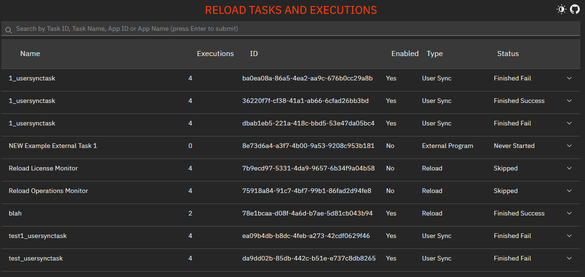
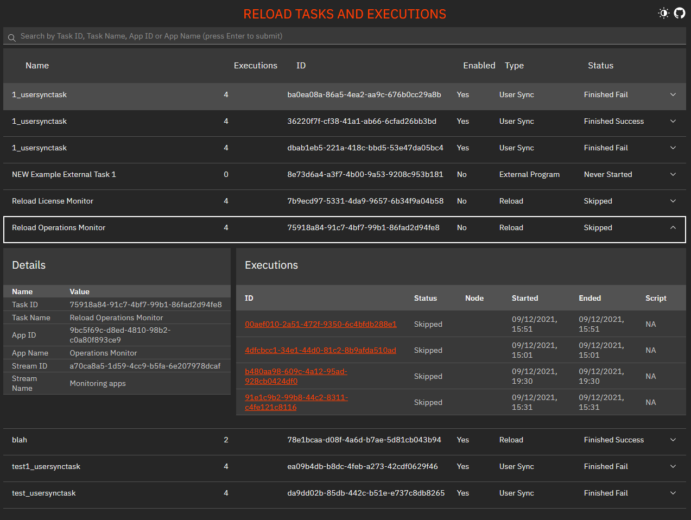
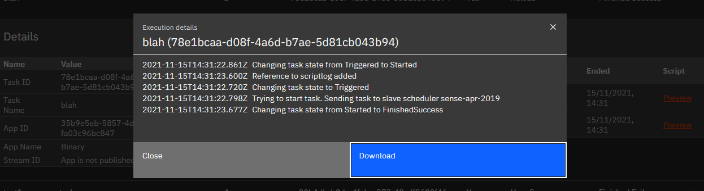
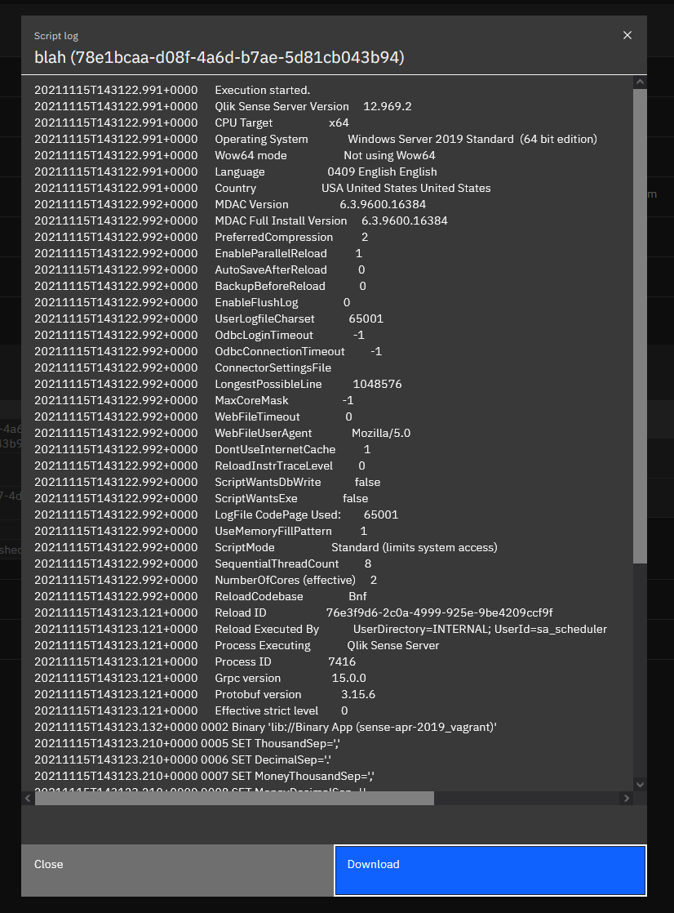

# Qlik Sense Tasks Executions Mashup

Small mashup that allows the user to view its reload tasks and their execution history

In QMC we can only see the last execution result and it's reload script (if available). This mashup shows all of the history

# Install

Just download the latest `zip` from the [release page](https://github.com/countnazgul/sense-task-executions-mashup/releases) and upload it as an extension from QMC

# Preview

- Main view
  

- Task details
  

- Execution details
  

- Reload script
  
